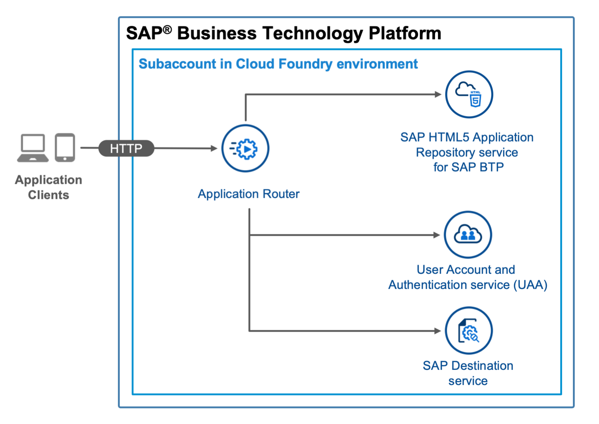
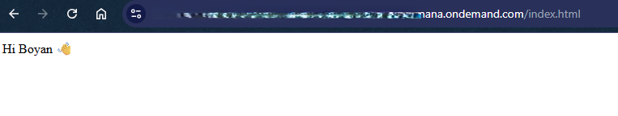
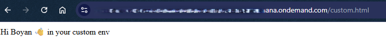

# On Standalone Application Router, Using HTML5 Application Repository, XSUAA Service, and Destination Service 

## Diagram



## Description
This is an example of an HTML5 app that you maintain on a standalone application router in your own space in the Cloud Foundry environment. The app is deployed to the HTML Application Repository and uses the Authentication & Authorization service (XSUAA service), the destination service, and the User API service.

This example demonstrates how to prepare deployment configurable application router where the configurations are defined or overriden into separate MTA extension descriptor files and `xs-app.json` is being adjusted. The example is based on [Basic App stored on HTML5 Application Repository, using  XSUAA service, and destination service](../standalone-approuter-html5-runtime-mta-hello-world)


## Download and Installation
1. Download the source code:
    ```
    git clone https://github.com/SAP-samples/multi-cloud-html5-apps-samples
    cd multi-cloud-html5-apps-samples/deployment-configurable-standalone-approuter-html5-runtime-mta-hello-world
    ```
2. Build the project:
    ```
    npm install
    npm run build
    ```
3. Deploy the project:
    ```
    cf deploy mta_archives/standalone-hello-world_1.0.0.mtar
    ```

If the deployment has been successful, you find the URL of the application router in the console output or you can print it on Unix-based systems with `cf app html5_app_router | awk '/^routes/ { print "https://"$2"/" }'`. It probably has the following structure: <https://[globalaccount-id]-dev-multi-cloud-html5-apps-samples.cfapps.eu10.hana.ondemand.com>.


## Check the Result

### List the Deployed HTML5 App

```
$ cf html5-list                                     
Getting list of HTML5 applications in org 9f10ed8atrial / space dev as firstname.lastname@domain.com...
OK

name         version   app-host-id                            service instance   visibility   last changed   
helloworld   1.0.0     1db2ae23-90e9-4055-a22c-6865ca7ad73e   html5_repo_host    public       Mon, 10 Aug 2020 13:26:03 GMT   
```

### List the Deployed MTA

```
$ cf mta standalone-hello-world
Showing health and status for multi-target app standalone-hello-world in org 9f10ed8atrial / space dev as firstname.lastname@domain.com...
OK
Version: 1.0.0

Apps:
name               requested state   instances   memory   disk   urls   
html5_app_router   started           1/1         256M     256M   9f10ed8atrial-dev-html5-app-router.cfapps.us10.hana.ondemand.com   

Services:
name                 service           plan          bound apps         last operation   
html5_destination    destination       lite          html5_app_router   create succeeded   
html5_repo_host      html5-apps-repo   app-host                         create succeeded   
html5_repo_runtime   html5-apps-repo   app-runtime   html5_app_router   create succeeded   
html5_uaa            xsuaa             application   html5_app_router   create succeeded   
```

### Check the Web App

Access the URL to view the web app. You are directed to a sign-on page before you can see the web app that display your name.



Note that the homepage is `index.html`

## Deployment specific configuration

This example demonstrates how to configure the SAP Application Router (approuter) with deployment-specific settings using templated values in `xs-app.json`. The approach allows you to deploy the same MTA across different environments (e.g., development, quality, production) with environment-specific configurations.

### Overview

The example uses a templated value for the [welcomeFile](https://www.npmjs.com/package/@sap/approuter#welcomefile-property) property in `xs-app.json`. This templating approach can be applied to any supported property in `xs-app.json` or its nested values, enabling flexible configuration management across deployment targets.

### Templating xs-app.json

Instead of hardcoding values in `xs-app.json` within the application router binary, a template file `xs-app-template.json` is introduced. This template file contains placeholders that are resolved at runtime.

**Example: `xs-app-template.json`**

```
{
  "welcomeFile": "/${WELCOME_FILE}",
  "authenticationMethod": "route",
  "routes": [
    {
      "source": "/user-api/currentUser$",
      "target": "/currentUser",
      "service": "sap-approuter-userapi"
    },
    {
      "source": "(.*)",
      "target": "/helloworldapprouter/$1",
      "service": "html5-apps-repo-rt"
    }
  ]
}
```

The `welcomeFile` property uses the placeholder `${WELCOME_FILE}`, which will be replaced with an actual value from environment variables during application startup.

**Key Points:**
- The template uses standard environment variable syntax: `${VARIABLE_NAME}`
- Multiple properties can be templated using the same approach
- Templates can be nested within routes, headers, or any other `xs-app.json` configuration

### Template Replacement Mechanism

Templates are replaced during the application router startup using the [envsub](https://www.npmjs.com/package/envsub) library. The replacement logic is defined in the start command of the application router's [package.json](router/package.json).

**Example: `router/package.json`**

```json
{
	"name": "appouter",
	"description": "Node.js based application router service for html5-apps",
	"dependencies": {
		"@sap/approuter": "latest",
		"envsub": "^4.1.0"
	},
	"scripts": {
		"start": "envsub xs-app-template.json xs-app.json && node node_modules/@sap/approuter/approuter.js"
	}
}
```

**How it works:**
1. **Add dependency**: Include `envsub` in the `dependencies` section
2. **Modify start script**: The start command performs two operations:
   - `envsub xs-app-template.json xs-app.json` - Substitutes environment variables in the template and generates the final `xs-app.json`
   - `node node_modules/@sap/approuter/approuter.js` - Starts the application router with the resolved configuration

> **Note:** The template replacement happens at runtime when the application router starts in Cloud Foundry, not during the build or deployment phase.

### Setting Default Values in MTA Descriptor

Default values for template variables are defined as environment properties in the MTA descriptor file. See [mta.yaml](mta.yaml):

**Example: `mta.yaml`**

```yaml
modules:
  - name: html5_app_router
    type: approuter.nodejs
...
    properties:
      WELCOME_FILE: index.html
...

```

The `WELCOME_FILE` environment variable is set to `index.html` as the default value. When the application router starts, this value replaces `${WELCOME_FILE}` in the template, resulting in `welcomeFile: "/index.html"` in the final `xs-app.json`.

### Environment-Specific Configuration with MTA Extension Descriptors

To customize configurations for different deployment targets (e.g., development, staging, production), use MTA extension descriptors (`.mtaext` files). These files override the default values defined in `mta.yaml`.

**Example: `custom-welcome-file.mtaext`**

```yaml
ID: standalone-hello-world-custom
extends: standalone-hello-world

modules:
  - name: html5_app_router
    properties:
      WELCOME_FILE: custom.html

```

**Deploying with MTA Extension Descriptor:**

To deploy with environment-specific configuration, use the `-e` flag:

```bash
cf deploy mta_archives/standalone-hello-world_1.0.0.mtar -e custom-welcome-file.mtaext
```

This command overrides the `WELCOME_FILE` environment variable, changing the welcome file from `index.html` to `custom.html`.

**Benefits of this approach:**
- **Single codebase**: Maintain one MTA archive for all environments
- **Flexibility**: Override any configuration property without rebuilding
- **Traceability**: Environment-specific settings are clearly documented in `.mtaext` files
- **Scalability**: Create multiple extension descriptors for different deployment scenarios

**Common use cases for templating:**
- Different welcome pages per environment
- Environment-specific authentication settings
- Variable route configurations
- Dynamic destination names
- Environment-dependent CORS settings

### Verify the Custom Configuration

After deploying with the custom extension descriptor, access the application URL. You will be directed to the custom home page (`custom.html`) instead of the default `index.html`. The custom page displays your name with a custom suffix.



**Verification steps:**
1. Access the application router URL in your browser
2. Authenticate using your credentials
3. Verify that `custom.html` is displayed as the welcome page
4. Check the Cloud Foundry environment variables: `cf env html5_app_router | grep WELCOME_FILE`

